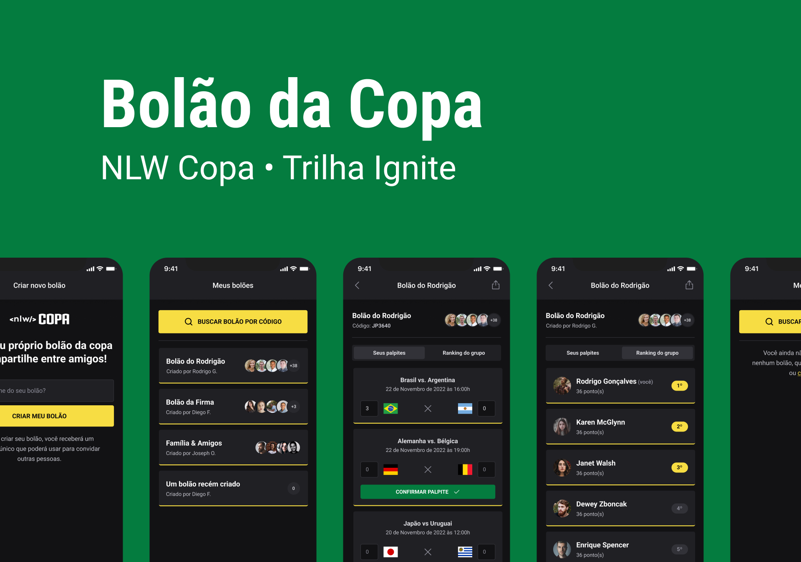

<h1 align="center">
    
</h1>

## 💻 Sobre o projeto

Aplicação desenvolvida durante a NLW Copa organizada pela Rocketseat, com a finalidade de realizar boloẽs para os jogos da Copa.

Simplesmente incrível! Foi uma NLW de muito aprendizado com conteúdos inéditos e muita mão na massa.

Na qual foi possível praticar muita coisa do universo JavaScript, por exemplo: Autenticação e rotas com o fastify, banco de dados com prisma, estilização na web com tailwindcss, estilização em apps mobile com native-base. Assim como uso e criação de hooks, tipagem e contextos.

Até o momento como extra eu adicionei a funcionalidade de salvar o Token do usuário no LocalStorage do dispositivo para fazer login automatico, assim como o funcionalidade de logout na aplicação mobile.

OBS: Ainda falta a implementação da funcionalidade de ranking do grupo na aplicação mobile.

---

## ⚙️ Funcionalidades

- Criar um novo bolão.
- Entrar em um bolão.
- Dar palpite nos bolões.
- Mostrar o numero de participantes do bolão.

Para o desenvolvimento foram aplicados conceitos como:
- ContextAPI
- LocalStorage
- Prisma
- Fastify
- Typescript

---

## 🛠 Tecnologias
As seguintes ferramentas foram usadas na construção do projeto:

#### **Website**  [Next.js](https://nextjs.org/docs/getting-started)

-   **[Tailwindcss](https://tailwindcss.com/n)**
-   **[Axios](https://axios-http.com/ptbr/docs/intro)**

#### **Server**  [Nodejs](https://nodejs.org/en/)

-   **[Tailwindcss](https://tailwindcss.com/n)**
-   **[Zod](https://axios-http.com/ptbr/docs/intro)**
-   **[Prisma](https://www.prisma.io/)**
-   **[Fastify](https://www.fastify.io/)**
-   **[Short unique id](https://www.npmjs.com/package/short-unique-id)**

#### **Mobile**  [Expo](https://nextjs.org/docs/getting-started)

-   **[Native base](https://tailwindcss.com/n)**
-   **[Axios](https://axios-http.com/ptbr/docs/intro)**
-   **[Country list](https://www.npmjs.com/package/country-list)**
-   **[Phosphor react](https://phosphoricons.com/)**
-   **[React native country flag](https://www.npmjs.com/package/react-native-country-flag)**
-   **[React navigation](https://reactnavigation.org/)**
-   **[Dayjs](https://www.npmjs.com/package/dayjs)**
-   **[Auth session](https://docs.expo.dev/versions/latest/sdk/auth-session/)**

---

## 🦸 Autor

  
 <b>Everton Schultz</b></a>
  

